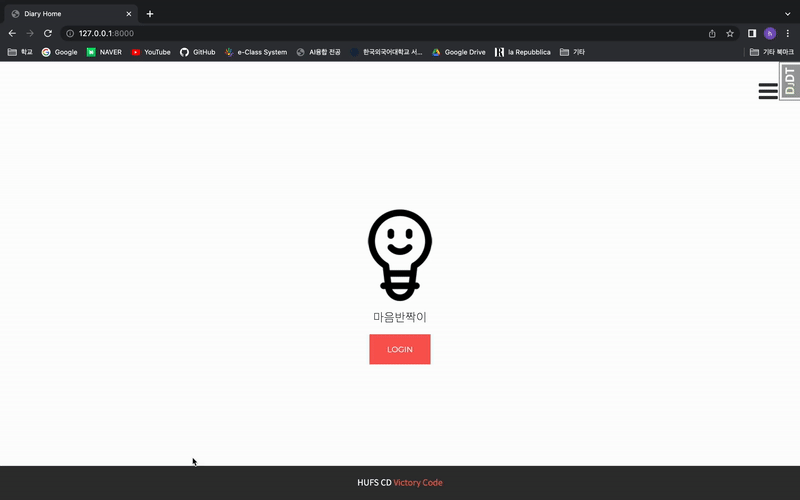
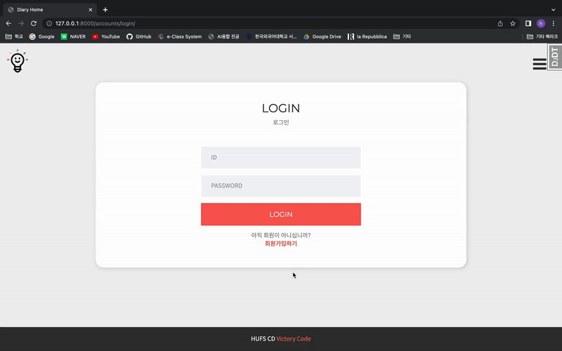
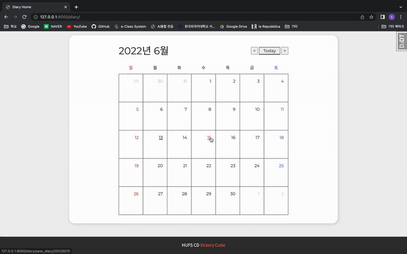
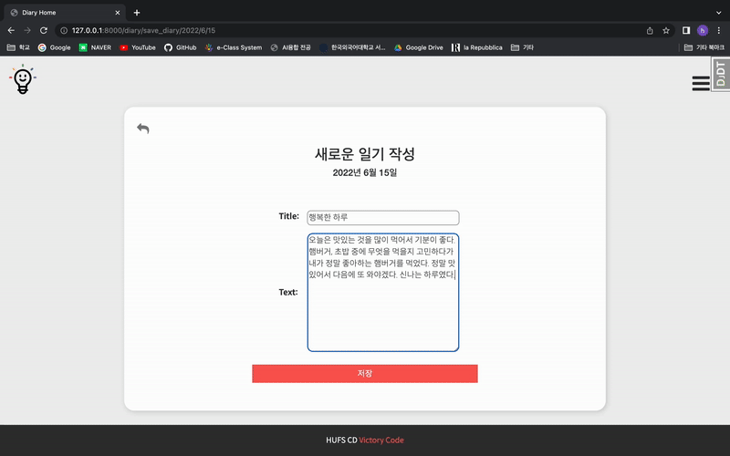
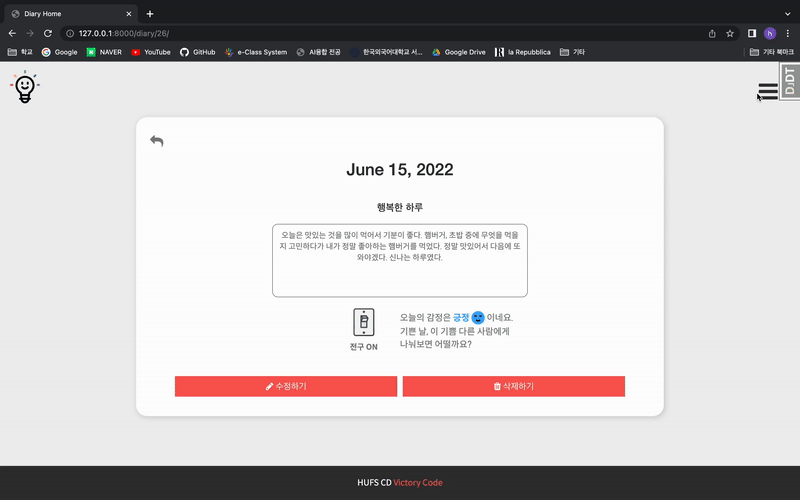
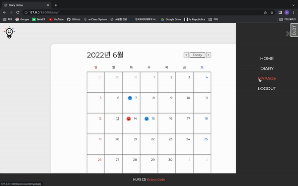

# 마음반짝이
###  일기 감정분석 결과에 따른 스마트 전구 색상 제어 프로젝트
한국외대 AI융합전공(SW&AI) 서울 종합설계 B2팀 저장소

- - -
## 팀원 소개
구분 |  담당자
----- | ----- 
프론트엔드  | 정수현
백엔드 | 박승리
모델 개발 | 한지은, 오석진

<br>

- - -

## 구현 내용 이미지

|스플래시 페이지|회원가입 페이지|
|:-:|:-:|
|||
|일기 작성|일기 분석 결과|
|||
|전구 정보 추가|전구 켜기|
|||
|감정 통계|
||
<br>

- - -
## 프로젝트 시작할 때
### 가상환경 설치
requirements.txt 파일이 있는 상위에서
```
python -m venv myvenv
```

### 라이브러리 설치 
```
pip install -r requirements.txt
```

### 앱 별로 나눠져 있는 static 폴더 내 파일들을 가장 상위 static 폴더로 모으기
manage.py 파일이 있는 디렉토리에서
```
python manage.py collectstatic
```

### 가상환경 켜기
- MAC
  ```
  source myvenv/bin/activate
  ```
- WINDOWS
  ```
  source myvenv/Scripts/activate
  ```

### 가상환경 끄기
```
deactivate
```

### 서버 키기
manage.py 파일이 있는 폴더에서
```
python manage.py runserver
```

- - -
## 데이터베이스 관련 설정
- makemigrations
  - model에 적용한 변경 내용을 기반으로 새로운 migrations 파일을 만든다.
  ```
  python manage.py makemigrations
  ```
- migrate
  - migrations를 적용 및 적용 해제
  - 해당 마이그레이션 파일을 DB에 반영
  ```
  python manage.py migration
  ```
